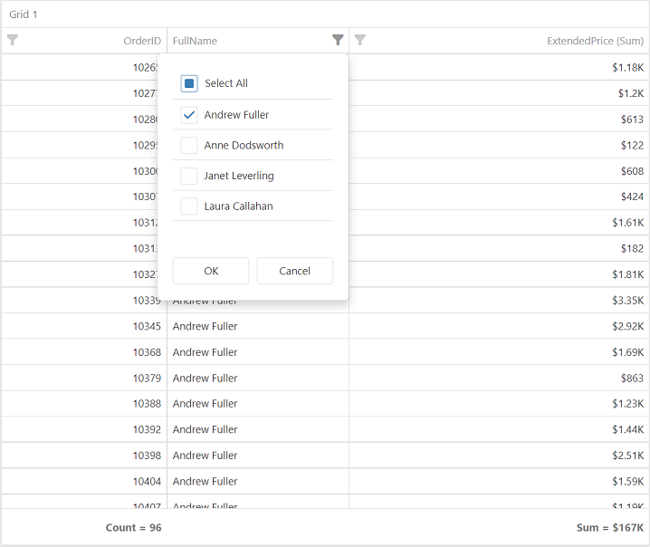

<!-- default badges list -->

[](https://supportcenter.devexpress.com/ticket/details/T885564)
[](https://docs.devexpress.com/GeneralInformation/403183)
<!-- default badges end -->
*Files to look at*:
- [extensions](./dashboard-angular-app/src/app/extensions)
- [app.component.html](./dashboard-angular-app/src/app/app.component.html)
- [app.component.ts](./dashboard-angular-app/src/app/app.component.ts)

# Dashboard for Angular - Custom Properties

The example shows how to create [custom properties](https://docs.devexpress.com/Dashboard/401702/designer-and-viewer-applications/web-dashboard/client-side-customization/custom-properties?v=20.1) for the Web Dashboard. ASP.NET Core dashboard control is a server application, an Angular application is used as a client.

## Quick Start

### Server

In the **asp-net-core-dashboard-backend** folder run the following command:

```
dotnet run
```

The server starts at `http://localhost:5000` and the client gets data from `http://localhost:5000/api/dashboard`. To debug the server, run the **asp-net-core-dashboard-backend** application in Visual Studio and change the client's `endpoint` property according to the listening port: `https://localhost:44301/api/dashboard`.

See the following section for information on how to install NuGet packages from the DevExpress NuGet feed: [Install DevExpress Controls Using NuGet Packages](https://docs.devexpress.com/GeneralInformation/115912/installation/install-devexpress-controls-using-nuget-packages).

> This server allows CORS requests from _all_ origins with _any_ scheme (http or https). This default configuration is insecure: any website can make cross-origin requests to the app. We recommend that you specify the client application's URL to prohibit other clients from accessing sensitive information stored on the server. Learn more: [Cross-Origin Resource Sharing (CORS)](https://docs.devexpress.com/Dashboard/400709)

### Client

In the **dashboard-angular-app** folder, run the following commands:

```
npm i
ng serve --open
```

Open ```http://localhost:4200/``` in your browser to see the Web Dashboard application.

## Overview

Custom properties are stored in the **CustomProperties** collection in a structured format. Each custom property in this collection contains the custom property's metadata. 

To apply custom property values to a dashboard, you need to create an extension. The extension is a JavaScript module that you can integrate into your application. Every extension that provides custom property can be divided into the following parts:

1. Model.

    The model is an object that contains the property name, type, and default value. It also specifies on which level the property is created (dashboard, dashboard item or data item container). Use the [Model.registerCustomProperty](https://docs.devexpress.com/Dashboard/js-DevExpress.Dashboard.Model.registerCustomProperty-1?v=20.1) property to register the custom property definition.

2. Viewer

    In this part you modify the viewer part according to the saved custom property value. You can use the client methods and events to change the displayed elements.

3. Designer

    This part contains designer settings. Add editors and control elements to configure and change the custom property's values in the UI. This part is not required if you use the extension in Viewer mode.

4. Event Subscription

    This part contains event subscriptions.
	
## Registration

To register an extension, import extension modules and call the `registerExtension` method before the control is rendered:

```html
<dx-dashboard-control
  style='display: block;width:100%;height:800px;'
  endpoint='http://localhost:5000/api'
  workingMode='Designer'
  (onBeforeRender)='onBeforeRender($event)'
>
</dx-dashboard-control>
```

```ts
import { DashboardControl, DashboardControlArgs, DashboardPanelExtension } from 'devexpress-dashboard';
import { ChartScaleBreaksExtension } from './extensions/chart-scale-breaks-extension';
import { ChartLineOptionsExtension } from './extensions/chart-line-options-extension';
import { ChartAxisMaxValueExtension } from './extensions/chart-axis-max-value-extension';
import { ChartConstantLinesExtension } from './extensions/chart-constant-lines-extension';
import { ItemDescriptionExtension } from './extensions/item-description-extension';
import { DashboardDescriptionExtension } from './extensions/dashboard-description-extension';
import { GridHeaderFilterExtension } from './extensions/grid-header-filter-extension';

// ...

export class AppComponent {
  title = 'dashboard-angular-app';

  onBeforeRender(args: DashboardControlArgs) {
    var dashboardControl = args.component;
    dashboardControl.registerExtension(new DashboardPanelExtension(dashboardControl));

    dashboardControl.registerExtension(new ChartScaleBreaksExtension(dashboardControl));
    dashboardControl.registerExtension(new ChartLineOptionsExtension(dashboardControl));
    dashboardControl.registerExtension(new ChartAxisMaxValueExtension(dashboardControl));
    dashboardControl.registerExtension(new ChartConstantLinesExtension(dashboardControl));
    dashboardControl.registerExtension(new ItemDescriptionExtension(dashboardControl));
    dashboardControl.registerExtension(new DashboardDescriptionExtension(dashboardControl));
    dashboardControl.registerExtension(new GridHeaderFilterExtension(dashboardControl));
  }
}
```

## Example structure

The following example contains a set of custom properties that demonstrate different capabilities. Below you find a detailed description for every extension.

### ChartScaleBreaksExtension

[View Extension](./dashboard-angular-app/src/app/extensions/chart-scale-breaks-extension.ts)

This extension enables or disables scale breaks for the Chart dashboard item.


**Overview**:
- Adds a custom Boolean property for a specific dashboard item (Chart).
- Integrates a _Scale breaks (Custom)_ section into the _Options_ menu with the [CheckBox](https://js.devexpress.com/DevExtreme/ApiReference/UI_Widgets/dxCheckBox/) widget as an editor.

### ChartLineOptionsExtension

[View Extension](./dashboard-angular-app/src/app/extensions/chart-line-options-extension.ts)

This extension changes the dash style of each series line in the Chart dashboard item.


**Overview**:
- Adds a string custom property for a specific data item container (Chart's series).
- Integrates a _Line Options (Custom)_ section into the data item menu with the [SelectBox](https://js.devexpress.com/DevExtreme/ApiReference/UI_Widgets/dxSelectBox/) widget as an editor.

### DashboardDescriptionExtension

[View Extension](./dashboard-angular-app/src/app/extensions/dashboard-description-extension.ts)

This extension enables you to set a dashboard's description in the dashboard menu. The dashboard description is displayed when you hover over the info button in the dashboard title. 


**Overview**:
- Adds a custom string property for a dashboard.
- Shows how to add a new item to the [ToolBox](https://docs.devexpress.com/Dashboard/117442/designer-and-viewer-applications/web-dashboard/ui-elements/toolbox?v=20.1). In this example, a new item is added to the [dashboard menu](https://docs.devexpress.com/Dashboard/117444/designer-and-viewer-applications/web-dashboard/ui-elements/dashboard-menu?v=20.1).
- Demonstrates how to create complex editors using templates. In this example, it is the [](https://js.devexpress.com/DevExtreme/ApiReference/UI_Widgets/dxPopup/) widgets with the [TextArea](https://js.devexpress.com/DevExtreme/ApiReference/UI_Widgets/dxTextArea/) and [Button](https://js.devexpress.com/DevExtreme/ApiReference/UI_Widgets/dxButtonGroup/) widgets inside.

### ItemDescriptionExtension

[View Extension](./dashboard-angular-app/src/app/extensions/item-description-extension.ts)

This extension enables you to set a description for each dashboard item. The dashboard item description is displayed when you hover over the info button in the item's caption. 


Overview:
- Adds a custom string property for each dashboard item.
- Integrates a _Description (Custom)_ section into the _Options_ menu with the predefined [buttonGroup](https://docs.devexpress.com/Dashboard/js-DevExpress.Dashboard.Designer.FormItemTemplates?v=20.1#js_devexpress_dashboard_designer_formitemtemplates_buttongroup_static) template.
- Shows how to enable or disable editors depending on a custom property's value. 

### ChartAxisMaxValueExtension

[View Extension](./dashboard-angular-app/src/app/extensions/chart-axis-max-value-extension.ts)

This extension allows you to change the maximum value of the Y-axis in the Chart item. 


Overview:
- Adds a set of custom properties with [different types](https://docs.devexpress.com/Dashboard/js-DevExpress.Dashboard.Model.CustomPropertyMetadata?v=20.1#js_devexpress_dashboard_model_custompropertymetadata_valuetype) (number, boolean, and string) for a specific dashboard item (Chart).
- Demonstrates how to bind a custom property to a list of data items.
- Shows how to enable or disable editors depending on a custom property's value. 

### ChartConstantLinesExtension

[View Extension](./dashboard-angular-app/src/app/extensions/chart-constant-lines-extension.ts)

This extension draws constant lines for the Chart dashboard item.


Overview:
- Adds a complex custom property for a specific dashboard item (Chart).
- Shows how to work with complex custom values that are saved as an array.
- Demonstrates how to bind a custom property to a list of data items.
- Customizes export to display the result in the exported document.

### GridHeaderFilterExtension

[View Extension](./dashboard-angular-app/src/app/extensions/grid-header-filter-extension.ts)

This extension adds Header Filter buttons to the Grid dashboard item.



Overview:
- Adds a custom property for a specific dashboard item (Grid).
- Integrates a _Header Filter (Custom)_ section, which contains the [ButtonGroup](https://js.devexpress.com/DevExtreme/ApiReference/UI_Components/dxButtonGroup/) widget as an editor, into the _Options_ menu.

## Documentation

- [Client-Side Customization](https://docs.devexpress.com/Dashboard/401701)
- [Custom Properties](https://docs.devexpress.com/Dashboard/401702)
- [Install DevExpress Controls Using NuGet Packages](https://docs.devexpress.com/GeneralInformation/115912/installation/install-devexpress-controls-using-nuget-packages)

## More Examples

- [ASP.NET Core Dashboard Control - Custom Properties](https://github.com/DevExpress-Examples/asp-net-core-dashboard-custom-properties-sample)
- [ASP.NET MVC Dashboard Control - Custom Properties](https://github.com/DevExpress-Examples/asp-net-mvc-dashboard-custom-properties-sample)
- [ASP.NET Web Forms Dashboard Control - Custom Properties](https://github.com/DevExpress-Examples/asp-net-web-forms-dashboard-custom-properties-sample)
- [WinForms Dashboard Designer - Custom Properties](https://github.com/DevExpress-Examples/winforms-dashboard-custom-properties)
- [WPF Dashboard Viewer - Custom Properties](https://github.com/DevExpress-Examples/wpf-dashboard-custom-properties)
- [Multiplatform Example - Constant Lines](https://github.com/DevExpress-Examples/dashboard-constant-lines)
